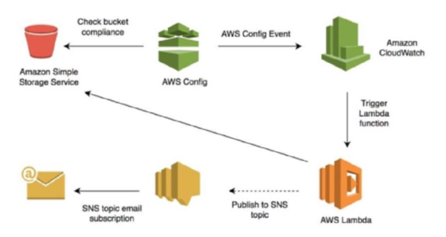
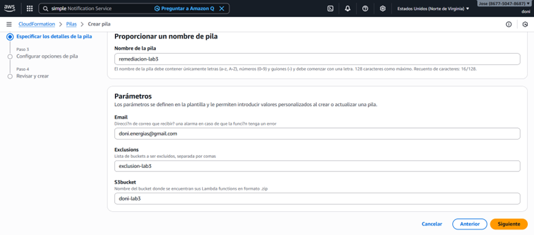
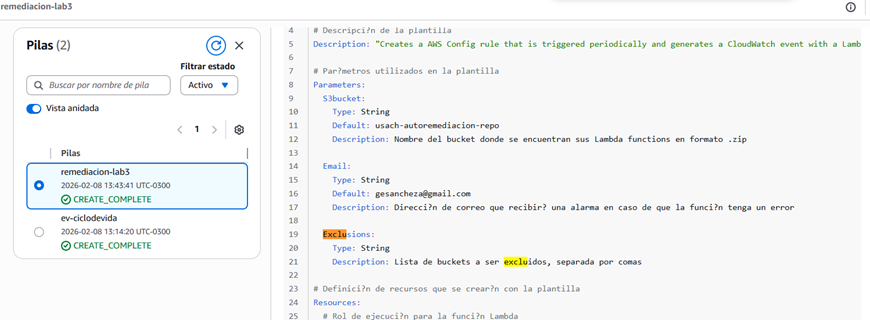
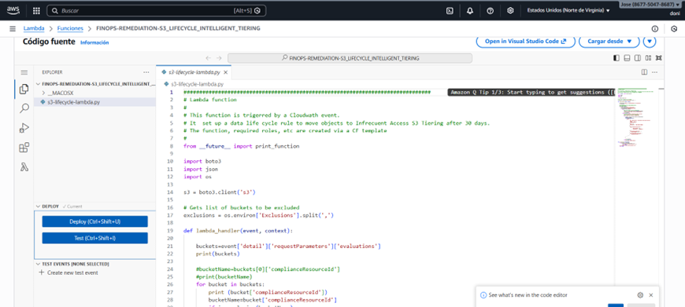
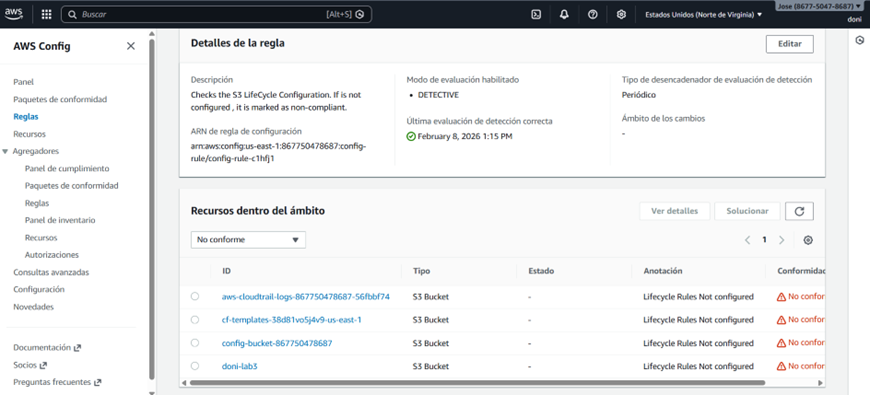
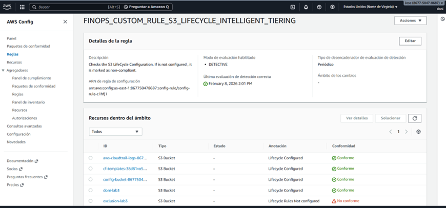

# ⚙️ AWS FinOps: Remediación Automática y Cumplimiento (S3)

Este proyecto implementa una arquitectura de **remediación automática** diseñada para garantizar el cumplimiento de políticas de ciclo de vida en Amazon S3. Utiliza un enfoque de **Seguridad Basada en Eventos** para detectar buckets que carecen de configuraciones de optimización de costos y corregirlos en tiempo real sin intervención humana.

## 🏗️ Arquitectura y Flujo de Datos
El sistema opera bajo una lógica circular de detección y respuesta proactiva:
1. **Detección**: AWS Config monitorea los buckets S3 basándose en reglas de cumplimiento[cite: 2].
2. **Evento**: Al detectar un recurso "No Conforme", se genera un evento en CloudWatch/EventBridge[cite: 2].
3. **Respuesta**: Se dispara una función **AWS Lambda** que aplica la regla de ciclo de vida necesaria[cite: 2].
4. **Notificación**: Se envía una alerta vía **Amazon SNS** al administrador confirmando la corrección[cite: 2].

## 🛠️ Implementación Técnica

### 1. Infraestructura como Código (IaC)
Todo el entorno se desplegó utilizando **AWS CloudFormation**, lo que garantiza que las políticas de seguridad sean replicables y consistentes[cite: 2]. Se utilizaron pilas para la detección y para la lógica correctiva como `remediacion-lab3`[cite: 2].

### 2. Configuración de Parámetros y Exclusiones
La plantilla permite un control granular mediante parámetros en formato **YAML**[cite: 2]. Un hito clave es la capacidad de definir **exclusiones** (como el bucket `exclusion-lab3`), demostrando que la automatización puede convivir con excepciones críticas de negocio[cite: 2].

### 3. Lógica de Automatización (Python 3.12)
El motor de remediación es una función Lambda escrita en **Python 3.12** que interactúa con la API de S3 para habilitar *Intelligent-Tiering* y transiciones de objetos, optimizando el gasto en almacenamiento de forma inteligente[cite: 2].

## 🧪 Validación de Resultados

### Hallazgo Inicial (No Cumplimiento)
Tras el primer escaneo de AWS Config, se identificaron múltiples recursos, incluido el bucket `doni-lab3`, en estado **No conforme** por falta de reglas de ciclo de vida[cite: 2].

### Resultado Final (Remediación Exitosa)
Una vez ejecutada la lógica de remediación, los recursos pasaron automáticamente a estado **Conforme**[cite: 2]. La prueba de control fue exitosa: todos los buckets fueron remediados excepto aquel definido en las exclusiones (`exclusion-lab3`), validando la precisión del sistema[cite: 2].

---

## 🚀 Habilidades Destacadas
* **Gobernanza Automatizada**: Reducción de la superficie de error mediante remediación automática[cite: 2].
* **Optimización de Costos (FinOps)**: Implementación masiva de políticas de ahorro en S3[cite: 2].
* **Cumplimiento Normativo**: Auditoría continua mediante AWS Config, vital para sectores regulados como la banca[cite: 2].

---
